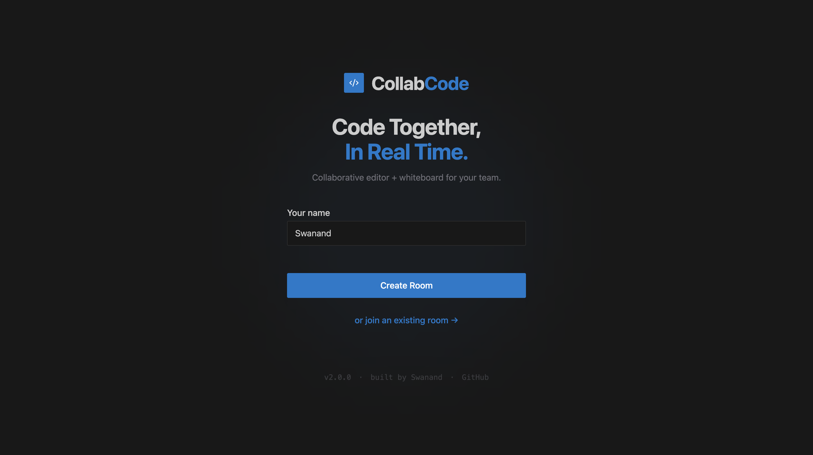
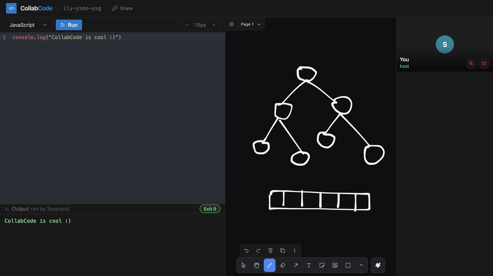

# CollabCode

A collaborative coding environment where multiple people can write and run code together in real time. Built for pair programming, interviews, or just hacking with friends.





## What it does

- Shared code editor that syncs as you type — no lag, no conflicts
- Run code directly in the browser (Python, JavaScript, TypeScript, Go)
- Collaborative whiteboard for diagrams and notes
- Voice and video via Agora
- Room-based: create a room, share the link, host approves who joins

## Tech

- **Frontend** — React, CodeMirror, tldraw, Yjs
- **Backend** — Express, Hocuspocus
- **Code execution** — Piston (sandboxed, self-hosted)
- **Voice/video** — Agora

## Running locally

```bash
npm install

# Start the server
npm run dev:server

# Start the client (in a separate terminal)
npm run dev:client
```

You'll also need Piston running for code execution:

```bash
docker compose -f docker-compose.piston.yml up -d
```

Then install the language runtimes you want using the [Piston CLI](https://github.com/engineer-man/piston). Runtimes are persisted in `data/piston/packages` so you only need to do this once.

Copy `apps/server/.env.example` to `apps/server/.env` and fill in your Agora credentials if you want voice/video. It's optional — everything else works without it.

## Deploying

See [docs/deployment.md](docs/deployment.md).
